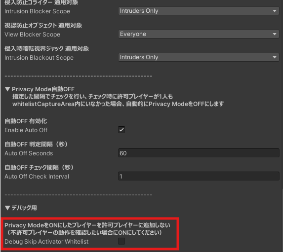

## 機能説明

Privacy Mode をONにした時に、以下の条件に一致するプレイヤーを許可プレイヤーとして登録します。

- Privacy Mode をONにしたプレイヤー
- パスワード認証を行ったプレイヤー
- 睡眠エリア内にいるプレイヤー

Privacy Mode をOFFにした時は、許可プレイヤーを全て削除します。 
（パスワード認証プレイヤーのみ、対象把握のため許可プレイヤーパネルに表示されます）
 
 
各機能ごとに、許可 / 非許可プレイヤーを判定して機能を適用します。 
適用対象については、各機能ページをご確認ください。
 
 
パスワード認証を行ったプレイヤーは、そのインスタンスでは必ず許可プレイヤーとして登録されるようになります。 
パスワード認証したプレイヤーを削除することはできません。

## 機能設定

PrivacySleepSystem オブジェクトの Inspector より、Play Modeやテストビルドでのデバッグ用に、Privacy Mode をONにしたプレイヤーを許可プレイヤーに登録しない設定が可能です。 
これにより、非許可プレイヤー側の見た目や動作確認を1人でも行えます。 
公開時は必ずOFFに設定してください。

