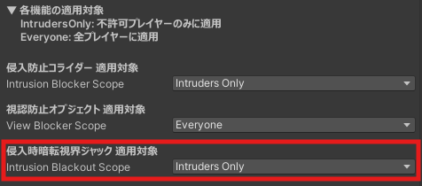

## 機能説明

【適用対象：非許可プレイヤーのみ】

非許可プレイヤーが睡眠エリアに入った場合、シェーダーにより視界ジャックを行い、視界を暗転させます。 
アバターの視界だけではなく、VRChat標準カメラやアバター用カメラギミック、ワールド用カメラギミック、三人称視点に対しても視界ジャックを行います。

## 機能設定

PrivacySleepSystem オブジェクトの Inspector より、適用対象の変更が可能です。 
なお、Everyoneに設定した場合、許可プレイヤーも睡眠エリア内で視界が暗転します。

