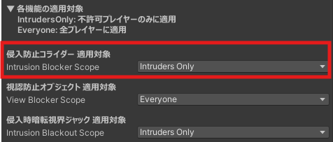

## 機能説明

【適用対象：非許可プレイヤーのみ】

前後左右上下の6方向のコライダーを制御し、非許可プレイヤーが睡眠エリアに入ることができなくなるようにします。

## 機能設定

PrivacySleepSystem オブジェクトの Inspector より、適用対象の変更が可能です。 
なお、Everyoneに設定した場合、許可プレイヤーも睡眠エリア内から外に出られず、リスポーンなどで外に出た場合は睡眠エリア内に入れなくなります。

