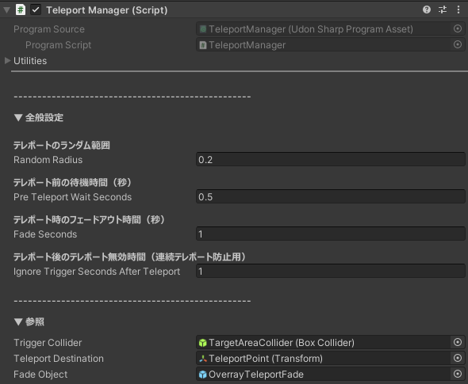

## 機能説明

【適用対象：非許可プレイヤーのみ】

非許可プレイヤーが睡眠エリアに入った場合、強制的に睡眠エリア外へテレポートさせます。 

## 機能設定

PrivacySleepSystem > System > TeleportManager オブジェクトの Inspector より、テレポート設定の変更が可能です。

- テレポートのランダム範囲 
<small>
テレポート先座標のランダムずらし半径です。 
0 の場合は、設定したテレポート先の座標へそのまま移動します。 
ずらしは XZ 方向のみで、Y 高さは変わりません。
</small>

- テレポート前の待機時間（秒） 
<small>
侵入判定後、実際にテレポートするまでの待機時間です。 
待機中は視界が暗転し、その場から移動できなくなります。 
0 の場合は即座にテレポートします。
</small>

- テレポート時のフェードアウト時間（秒） 
<small>
テレポート後に暗転を解除していく時間です。 
0 の場合はフェードせず、すぐに暗転を解除します。
</small>

- テレポート後のテレポート無効時間（連続テレポート防止用） 
<small>
テレポート直後に再び判定へ入って連続テレポートしないようにする無効時間です。 
この時間中は侵入判定を一時停止します。
</small>