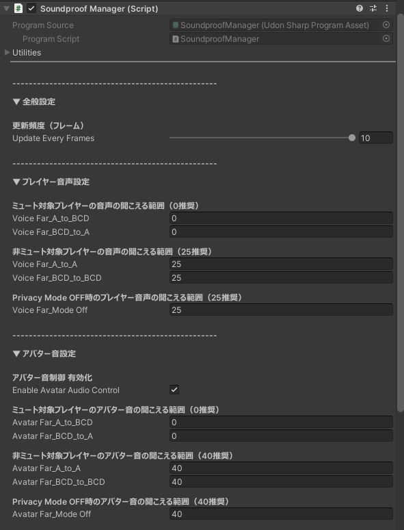

## 機能説明

【適用対象：許可 / 非許可プレイヤー の両方】

### プレイヤー音声 / アバター音
プレイヤーを以下のパターンで判定して、プレイヤー間の音を防音します。

- 防音しないパターン 
    - 睡眠エリア内にいる許可プレイヤー 
    ↕ 
    睡眠エリア内にいる許可プレイヤー
    - 睡眠エリア外にいる許可 / 非許可プレイヤー 
    ↕ 
    睡眠エリア外にいる許可 / 非許可プレイヤー

- 防音するパターン
    - 睡眠エリア内にいる許可プレイヤー 
    ↕ 
    睡眠エリア内にいる<u>**非許可**</u>プレイヤー
    - 睡眠エリア内にいる許可プレイヤー 
    ↕ 
    睡眠エリア外にいる許可 / 非許可プレイヤー

### ワールド音
制御対象のワールド音は、ワールド音（Audio Source）の座標から、以下のように判定して防音します。 
許可 / 非許可プレイヤーの判定はしていません。

- ワールド音が睡眠エリア内にある場合 
　→睡眠エリア外のプレイヤーには聞こえない

- ワールド音が睡眠エリア外にある場合 
　→睡眠エリア内のプレイヤーには聞こえない

## 機能設定

PrivacySleepSystem > System > SoundproofManager オブジェクトの Inspector より、防音設定の変更が可能です。

- 更新頻度（フレーム） 
<small>
防音状態を何フレームごとに更新するかを設定します。 
値を小さくすると反映は細かくなりますが、負荷は高くなります。
</small>

### プレイヤー音声に関する設定
- ミュート対象プレイヤーの音声の聞こえる範囲（0推奨） 
    - voiceFar_A_to_BCD 
    <small>
    以下パターンの設定です。（矢印の上のプレイヤーが音を出す側） 
    睡眠エリア内にいる許可プレイヤー 
    ↓ 
    睡眠エリア外にいる許可プレイヤー 
    睡眠エリア内にいる非許可プレイヤー 
    睡眠エリア外にいる非許可プレイヤー 
    </small>
    - voiceFar_BCD_to_A 
    <small>
    以下パターンの設定です。（矢印の上のプレイヤーが音を出す側） 
    睡眠エリア外にいる許可プレイヤー 
    睡眠エリア内にいる非許可プレイヤー 
    睡眠エリア外にいる非許可プレイヤー 
    ↓ 
    睡眠エリア内にいる許可プレイヤー 
    </small>

- 非ミュート対象プレイヤーの音声の聞こえる範囲（25推奨） 
    - voiceFar_A_to_A 
    <small>
    以下パターンの設定です。（矢印の上のプレイヤーが音を出す側） 
    睡眠エリア内にいる許可プレイヤー 
    ↓ 
    睡眠エリア内にいる許可プレイヤー 
    </small>
    - voiceFar_BCD_to_BCD 
    <small>
    以下パターンの設定です。（矢印の上のプレイヤーが音を出す側） 
    睡眠エリア外にいる許可プレイヤー 
    睡眠エリア内にいる非許可プレイヤー 
    睡眠エリア外にいる非許可プレイヤー 
    ↓ 
    睡眠エリア外にいる許可プレイヤー 
    睡眠エリア内にいる非許可プレイヤー 
    睡眠エリア外にいる非許可プレイヤー 
    </small>

- Privacy Mode OFF時のプレイヤー音声の聞こえる範囲（25推奨） 
<small>
Privacy ModeがOFFの時の設定です。 
許可 / 非許可プレイヤーかどうかや睡眠エリア内外にいるかどうかは関係ありません。
</small>

### アバター音に関する設定
- アバター音制御 有効化 
<small>
アバター音の個別制御を有効にします。 
OFF の場合、Privacy Mode 中でもアバター音は防音されません。
</small>

- ミュート対象プレイヤーのアバター音の聞こえる範囲（0推奨） 
    - avatarFar_A_to_BCD 
    <small>
    以下パターンの設定です。（矢印の上のプレイヤーが音を出す側） 
    睡眠エリア内にいる許可プレイヤー 
    ↓ 
    睡眠エリア外にいる許可プレイヤー 
    睡眠エリア内にいる非許可プレイヤー 
    睡眠エリア外にいる非許可プレイヤー 
    </small>
    - avatarFar_BCD_to_A 
    <small>
    以下パターンの設定です。（矢印の上のプレイヤーが音を出す側） 
    睡眠エリア外にいる許可プレイヤー 
    睡眠エリア内にいる非許可プレイヤー 
    睡眠エリア外にいる非許可プレイヤー 
    ↓ 
    睡眠エリア内にいる許可プレイヤー 
    </small>

- 非ミュート対象プレイヤーのアバター音の聞こえる範囲（40推奨） 
    - avatarFar_A_to_A 
    <small>
    以下パターンの設定です。（矢印の上のプレイヤーが音を出す側） 
    睡眠エリア内にいる許可プレイヤー 
    ↓ 
    睡眠エリア内にいる許可プレイヤー 
    </small>
    - avatarFar_BCD_to_BCD 
    <small>
    以下パターンの設定です。（矢印の上のプレイヤーが音を出す側） 
    睡眠エリア外にいる許可プレイヤー 
    睡眠エリア内にいる非許可プレイヤー 
    睡眠エリア外にいる非許可プレイヤー 
    ↓ 
    睡眠エリア外にいる許可プレイヤー 
    睡眠エリア内にいる非許可プレイヤー 
    睡眠エリア外にいる非許可プレイヤー 
    </small>

- Privacy Mode OFF時のアバター音の聞こえる範囲（40推奨） 
<small>
Privacy ModeがOFFの時の設定です。 
許可 / 非許可プレイヤーかどうかや睡眠エリア内外にいるかどうかは関係ありません。
</small>