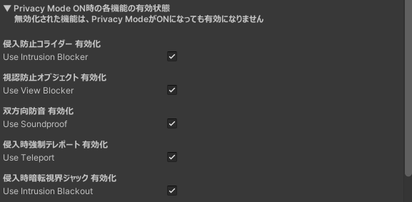
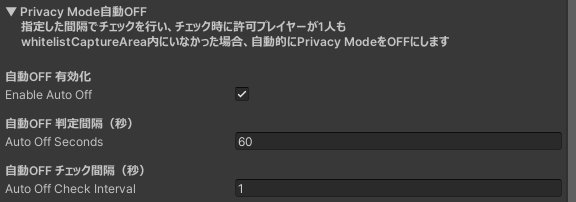
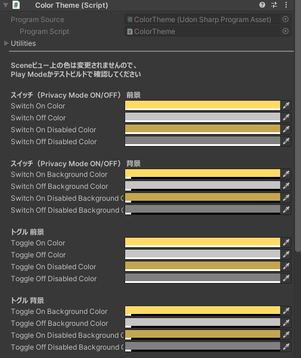
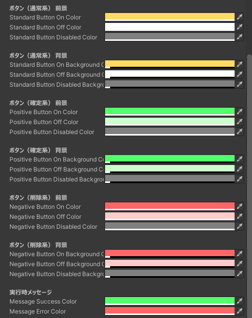

## 機能設定

PrivacySleepSystem オブジェクトの Inspector より、機能ごとの有効 / 無効と、Privacy Modeの自動OFFの設定が可能です。

機能ごとの有効 / 無効は、以下の組み合わせで設定した場合、メインパネルのトグルが非表示になります。

- 侵入防止コライダー無効化 + 侵入時強制テレポート無効化 
→ 「侵入防止」トグル非表示
- 視認防止オブジェクト無効化 + 侵入時暗転視界ジャック無効化 
→ 「視認防止」トグル非表示

## 色設定

PrivacySleepSystem > System > ColorTheme オブジェクトの Inspector より、UIの色設定が可能です。 
Sceneビュー上で変更した色の確認はできないため、Play Modeかテストビルドでご確認ください。

