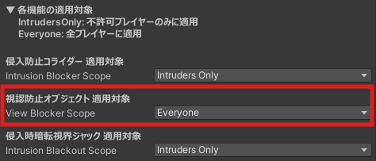
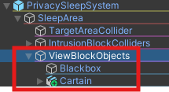

## 機能説明

【適用対象：許可 / 非許可プレイヤー の両方】

前後左右のカーテンオブジェクトと上下用のBoxオブジェクトを制御し、非許可プレイヤーが睡眠エリア内を外側から視認できなくなるようにします。 
また、睡眠エリア内からも外側を視認できなくします。

## 機能設定

PrivacySleepSystem オブジェクトの Inspector より、適用対象の変更が可能です。 

オブジェクトを別のものに変更したい場合は、PrivacySleepSystem > SleepArea > ViewBlockObjects 内に変更したいオブジェクトを配置し、不要なオブジェクトは Inactive にしてください。

