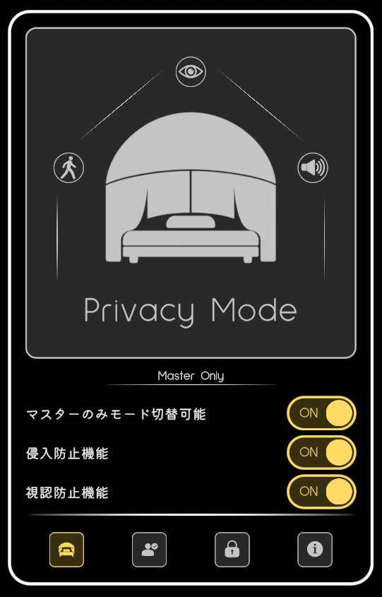
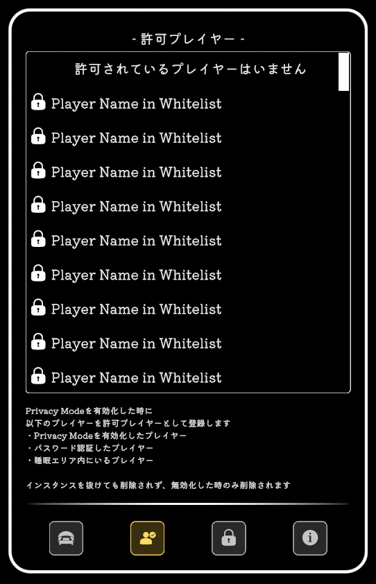
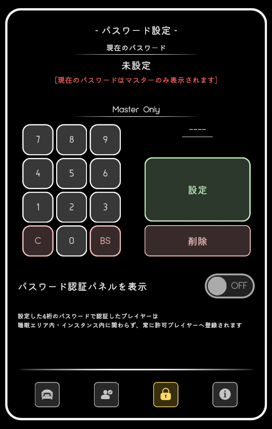
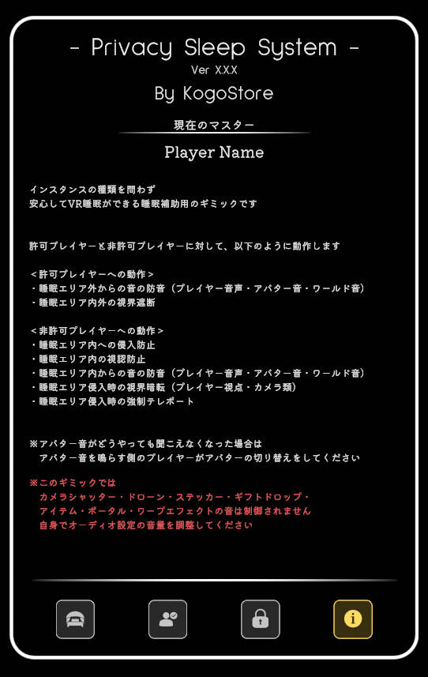
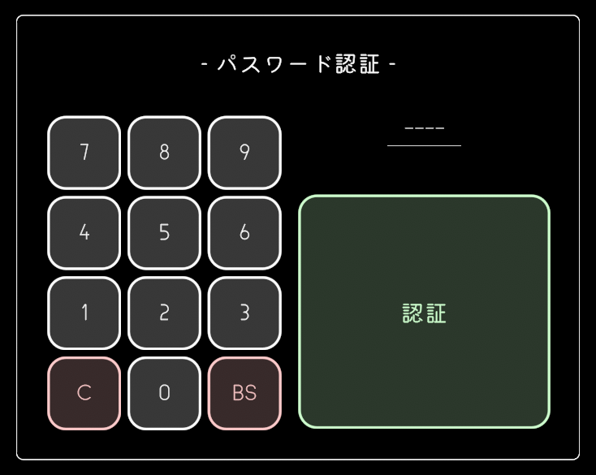

## メイン画面

主に操作することになる画面です。

- Privacy Mode スイッチ 
<small>
Privacy ModeのON/OFFを切り替えます。 
デフォルトではインスタンスマスターのみが切り替えできます。
</small>
- マスターのみモード切替可能 トグル 
<small>
OFFにすると、Privacy Modeを誰でもONに切り替えられるようにします。 
また、OFFに切り替えられるのは許可プレイヤーのみになります。 
このトグルを操作できるのはインスタンスマスターのみです。
</small>
- 侵入防止 トグル 
<small>
OFFにすると、以下の侵入防止機能がOFFになります。 
・侵入防止コライダー 
・侵入時強制テレポート 
このトグルを操作できるのはインスタンスマスターのみです。
</small>
- 視認防止 トグル 
<small>
OFFにすると、以下の視認防止機能がOFFになります。 
・視認防止オブジェクト 
・侵入時暗転視界ジャック 
このトグルを操作できるのはインスタンスマスターのみです。
</small>

## 許可プレイヤー画面

許可プレイヤーの一覧を表示する画面です。

Privacy ModeがONになった時に登録した許可プレイヤーを表示します。 
また、パスワード認証を行ったプレイヤーはPrivacy ModeがOFFの場合でも表示され、一覧上で南京錠アイコンが表示されます。

## パスワード設定画面

パスワード認証用のパスワードを設定する画面です。

- 現在のパスワード 表示 
<small>
パスワードを設定すると、設定したパスワードが表示されます。 
パスワードが表示されるのはインスタンスマスターだけで、他のプレイヤーには **** で表示されます。
</small>
- パスワード入力 エリア 
<small>
4桁の数字でパスワードを入力し、設定ボタンを押すことで、パスワードを設定できます。 
また、削除ボタンを押すと設定したパスワードを削除して未設定状態にします。 
削除しても、既にパスワード認証済みのプレイヤーは許可プレイヤーとして残ります。 
入力中のパスワードは自分自身にのみ表示されています。
</small>
- パスワード認証パネルを表示 トグル 
<small>
ONにすると、パスワード認証用の画面を表示します。 
このトグルを操作できるのはインスタンスマスターのみです。
</small>

## インフォメーション画面

ギミックの概要や注意点を記載した画面です。

- 現在のマスター 表示 
<small>
現在のインスタンスマスターを表示します。 
インスタンスマスターがインスタンスを抜けた場合は、自動的に新しいインスタンスマスターに切り替わります。 
※新しいインスタンスマスターが誰になるかはVRChat側の仕様に依存します。
</small>

## パスワード認証画面

パスワード認証用の画面です。

パスワード設定画面で「パスワード認証パネルを表示 トグル」をONにしている時だけ表示されます。

- パスワード入力 エリア 
<small>
4桁の数字でパスワードを入力し、認証ボタンを押すことで、パスワード認証を行います。 
入力したパスワードが設定済みのパスワードと一致していれば、許可プレイヤーへ登録します 
入力中のパスワードは自分自身にのみ表示されています。
</small>
