## 動作環境

本ギミックは、以下の環境で開発・動作確認を行っています。

- Unity: 2022.3.22f1
- VRChat SDK - Worlds: 3.10.2

## 1. Unity Packageのインポート

[商品ページ](https://kogostore.booth.pm/items/8062290) より最新バージョンの商品ファイルをダウンロードし、中にある PrivacySleepSystem.unitypackage をプロジェクトにインポートしてください。

## 2. Prefabの配置

以下のPrefabファイルをSceneに配置してください。

- Assets/KogoStore/PrivacySleepSystem/Prefab/PrivacySleepSystem.prefab

## 3. 本体位置の調整

配置した <u>**PrivacySleepSystem**</u> を選択し、Inspector より Transform の <u>**Position Y が 0**</u> となっていることを確認してください。 
0 になっていない場合は、0 に設定してください。

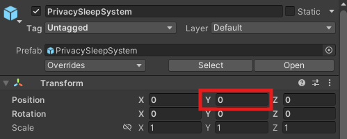

!!! warning "注意"
    床の高さ(Y)が 0 の位置を想定していますので、床の高さが 0 ではない場合、床の高さに合わせて設定してください。
    デフォルトでは、睡眠エリア( SleepArea )の下部が少し床にめり込むように調整しています。（位置ずれによる検出漏れ防止のため）

## 4. 睡眠エリア位置の調整

PrivacySleepSystem 内にある <u>**SleepArea**</u> の Transform を、下部が少し床にめり込むように調整してください。（位置ずれによる検出漏れ防止のため）

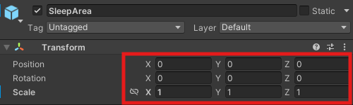
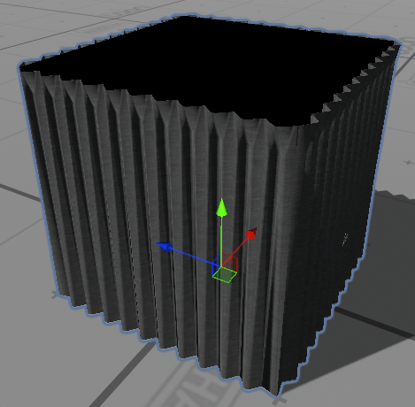

!!! warning "注意"
    SleepArea 内にある各オブジェクトの Transform や Box Collider の範囲は個別に調整せず、できるだけ SleepArea の Transform のみを調整するようにしてください。
    各機能ごとの指定範囲がずれてしまい、意図した動作をしなくなる可能性があります。

カーテンは前後左右の4方向で別オブジェクトにしていますので、不要な方向がある場合は <u>**SleepArea > ViewBlockObjects > Curtain**</u> 内の各方向に応じたオブジェクトを Inactive にしてください。 
Blackbox は上下方向からの視認防止の役割がありますので、Inactive にはしないでください。

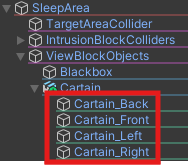

調整が完了したら、SleepArea > ViewBlockObjects は Inactive にしても問題ありません。

!!! tips "推奨設定"
    SleepArea の X:Y:Z のスケール比率を 1:1:1 以外に変更すると、カーテンのテクスチャ比率が崩れることがあります。 
    必要に応じて、カーテンのマテリアルの Tiling を調整してください。 
     
    また、4枚のカーテンは同じマテリアルを共有しています。 
    前後左右の各カーテンで異なる比率にしたい場合は、マテリアルを複製して個別に設定してください。

## 5. テレポート位置の調整

PrivacySleepSystem 内にある <u>**TeleportPoint**</u> のTransformを、お好みに合わせて調整してください。

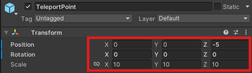

!!! tip "推奨設定"
    TeleportPoint にアタッチされた Parent Constraint コンポーネントの Sources に VRCWorld を設定することで、リスポーン位置と同じ位置に設定できます。

    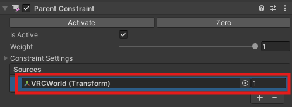

!!! warning "注意"
    無限テレポートや連続侵入となる可能性がありますので、SleepArea から離れた位置にしてください。

## 6. テレポート用暗転オーバーレイ位置の調整

1. PrivacySleepSystem > UI内にある <u>**OverlayTeleportFade**</u> を Active にしてください。
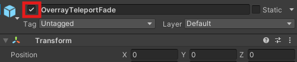

2. <u>**OverrlayTeleportFade**</u> のTransformを、SleepArea と TeleportPoint の両方が<u>**Box内に入るように**</u>調整してください。
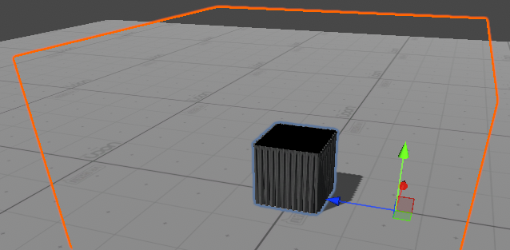

3. 調整後、<u>**OverlayTeleportFade**</u> を Inactive に戻してください。
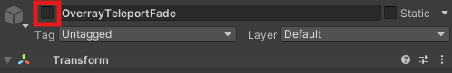

## 7. UI位置の調整

PrivacySleepSystem > UI内にある <u>**InsideUI と OutsideUI**</u> のTransformを、お好みに合わせて調整してください。

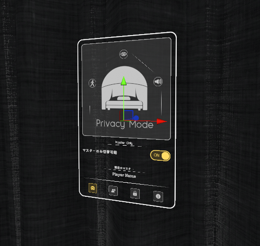
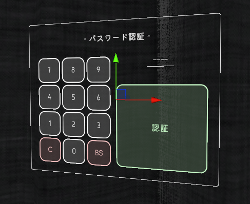

!!! warning "注意"
    InsideUI は SleepArea の範囲内への設置を推奨します。OutsideUI は必ず SleepArea の範囲外に設置してください。

## 8. ワールド音の設定

PrivacySleepSystem > System内にある <u>**SoundproofManager**</u> のInspectorより、制御対象にしたいワールド音のAudio Sourceを設定してください。

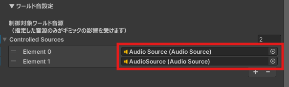

!!! warning "注意"
    制御対象に設定されていないワールド音は、Privacy Mode をONにしても通常通り聞こえます。 
    制御対象となったワールド音の聞こえ方については、[双方向防音](features/mutual_soundproof.md) のページを確認してください。

 
以上でセットアップは完了です。 
各機能の設定方法については、メニューより各機能ごとのページでご確認ください。